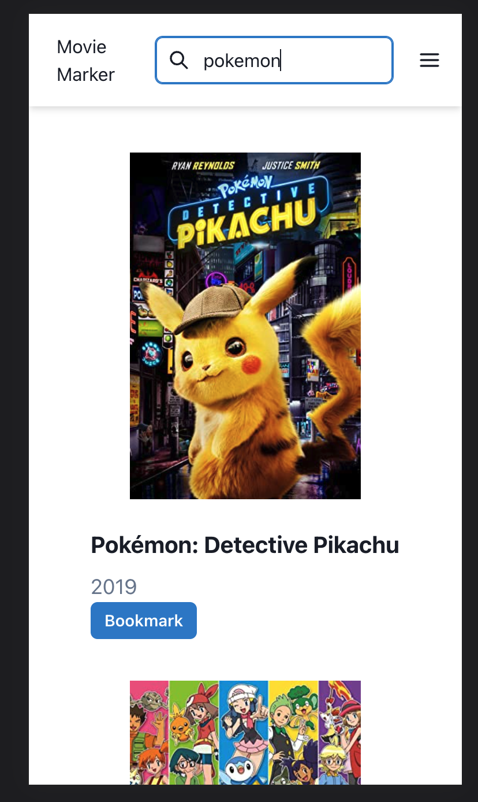

# Movie Marker

Movie Marker is a web application that allows users to search for movies and bookmark their favorite ones for later viewing.

Here is the Live Site: https://movie-marker.vercel.app/

## Mobile Screenshots:




## Getting Started

To get started with the app, first clone the repository:

```
git clone git@github.com:jolouie7/movie-marker.git
```

Then, navigate into the project directory and install the necessary dependencies:

```
cd movie-marker
npm install
```

After installing the dependencies, start the development server:

```
npm run dev
```

The app should now be running at http://localhost:3000.

## Features

- **Search for movies**: Users can search for movies using the search bar in the navbar. Results display the movie's poster, title, and year of release.

- **Bookmark movies**: Users can bookmark movies for later viewing.

- **View bookmarks**: Users can view their bookmarked movies.

- **Remove bookmarks**: Users can remove bookmarks.

- **Add to Watched List**: Users can add to a watched list.

## Testing

The app includes a suite of Jest and React Testing Library tests to ensure that the components and functions are working correctly. To run the tests, use the command:

```
npm run test
```

## Technologies Used

- Next.js
- Chakra UI
- Typescript
- React Query

## Future Improvements

- Notes for why you bookmarked a movie
- Add a database
- A share link to share your list of bookmarked movies
- Dark mode
- Use of better colors and typography
